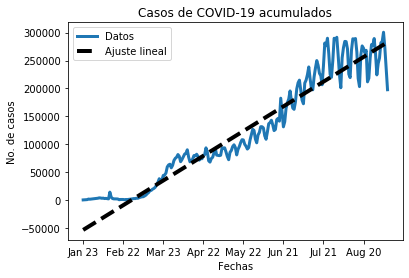

# Actividad Integradora #1
##### Este repositorio contiene un raspador web que monitorea los casos acumulados de coronavirus publicados en la página [Worldometers](https://www.worldometers.info/coronavirus/), además de realizar una regresión lineal para modelar este fenómeno.

Utilizando las librerias BeatifulSoup y requests de Python, el programa realiza un scrapping de la gráfica de infecciones, así como de las tablas de casos reportados de coronavirus.  La información de las tablas es divida respecto a las variables de fecha y número de casos reportados, los datos se grafican con respecto a esas variables junto con el modelo de regresión lineal que se realizó.

El código plasmado en el Jupyter Notebook, es útil no solo para mostrar de forma gráfica la distribución de casos de covid, sino tambien para predecir el número de casos con un modelo de regresión lineal.

Consideramos que el programa y el formato en el que se presenta podrían ser útiles para estudiantes que busquen una referencia al inicializar sus primera prácticas en el mundo de la ciencia de datos, especialmente debido al hecho de que se utilizan en conjunto bibliotecas de uso frecuente dentro de este campo. 

##### Representación y fuente de datos
Todos datos utilizados se utilizan de la página [worldometer Coronavirus Cases](https://www.worldometers.info/coronavirus) con la herramienta de webscraping [Beautiful Soup](https://www.crummy.com/software/BeautifulSoup/bs4/doc).

##### Dependencias
1. Beautiful soup `conda install beautifulsoup4`
2. Numpy
3. Matplolib
4. Pandas
5. Datetime

##### Algoritmo
Utilizando 

Para detalles del código, podrá refererirse a los integrantes de este equipo de trabajo: 
- Integrante 1
- Integrante 2
- Integrante 3
- Felipe de Jesús Villaseñor A01382445
- Oscar Lerma A01380817

En caso de estar interesado en una introducción al mundo del web scrapping y algunas de sus bibliotecas, adjuntamos el siguiente tutorial:
- [Beautiful Soup Web Scraper Tutorial](https://realpython.com/beautiful-soup-web-scraper-python/)

Para aprovechar al máximo este repositorio y poder editarlo al momento de descargarlo se recomienda el uso de Jupyter Notebook mediante Anaconda: 
1. Instalar [Anaconda](https://www.anaconda.com/products/individual)
2. Abrir Jupyter Notebook
